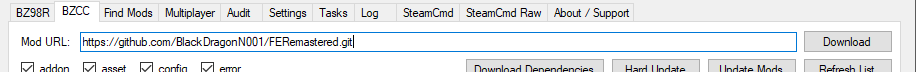

# Battlezone Combat Commander - Forgotten Enemies: Remastered

 

 

## Getting Started:
###   Battlezone Redux Mod Manager Installation Instructions:

1. Download and extract the latest realease of the Battlezone Redux Mod Manager:

	https://github.com/Nielk1/Battlezone-Redux-Mod-Manager/releases
	
2: Downlaod and install Git [here](https://git-scm.com/downloads)._  
	**Note:** After installing Git, run Git CMD and put in the following command **git config --global core.autocrlf false**

1. Battlezone Redux Mod Manager Setup:  
    1. Followthe setup instructions for BZRMM.  
	2. Open **`BZRModManager.exe`** and select the **`Settings`** tab.   
	**Note:** _Make sure to set the install location for BZCC (either GOG or Steam) and set the_ **`My Docs/My Games`** _folder location._ 
	
	3. Click the **`BZCC tab`** and paste the github url for Forgotten Enemies Remastered (https://github.com/BlackDragonN001/FERemastered.git) into the **`Mod URL`** field.
	4. Click the download dowload button.   
	**Note:** _If a Branch Select window pops up, select "master". (This will take a long time to download, See the_ **`Tasks`** _tab to watch the current progress)_
	
	5. Once **`Busy Tasks`** is 0 at the bottom of BZRMM, select all Forgotten Enemies Remastered Mods and choose either **`Install GOG`** or **`Install Steam`** in the right-click menu
	
	6. Start Battlezone Combat Commander and activate **`Forgotten Enemies: Remastered`** from the mods menu
	7. Have fun!

###  Powershell Install Instructions

1. Open an administrator powershell window (type '**_powershell_**' into windows search and right click and select '**_Run as administrator_**')

1. Run the following command **`Set-ExecutionPolicy -Scope Process Unrestricted`** and then enter '**_y_**' for yes.

1. Navigate to the FERemastered repo in powershell. This can be done by running **`Set-Location -Path "C:\Users\User\FERemastered"`** if the FERemastered repo was cloned into **`C:\Users\User\FERemastered`**.

1. Run **`.\install.ps1`**. This will create an install of FERemastered in your user home directory.
The install directory can be customised by running 
	> **`./install.ps1 -FeInstallDirectory C:\Games\FE`**
1. If the install directory of Battlezone Combat Commander is different to default you can run the following 
	> **`./install.ps1 -FeInstallDirectory C:\Games\FE -BzInstallDirectory G:\Steam\steamapps\common\BZ2R`**

## Get Involved:
Interested in contributing to Forgotten Enemies Remastered?
1. Request to contribute to the repository.
2. Join the Battlezone Community Server below:   

  

## References:
1. How to install [Git](https://git-scm.com/book/en/v2/Getting-Started-Installing-Git).
2. Neilk1's Battlezone Redux Mod Manager [repository](https://github.com/Nielk1/Battlezone-Redux-Mod-Manager).
3. Steam download [link](https://store.steampowered.com/about/).
4. GOG download [link](https://www.gog.com/galaxy).
5. Battlezone Combat Commander on [Steam](https://store.steampowered.com/app/624970/Battlezone_Combat_Commander/).
6. Battlezone Commbat Commander on [GOG](https://www.gog.com/en/game/battlezone_combat_commander).

<!--
 
 

  
>