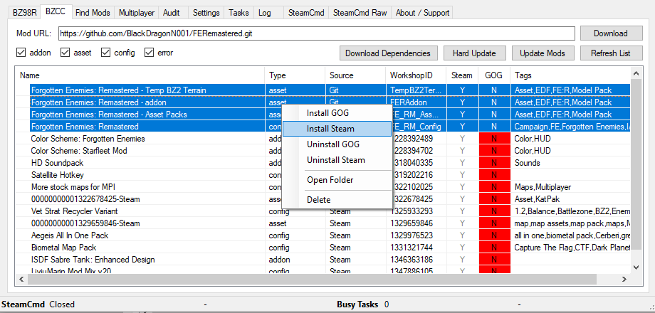

# Forgotten Enemies: Remastered

## BZRMM Installation Instructions:
1. If you do not have Git installed download and install it from [git-scm.com](https://git-scm.com/download/win) using the default options. 
(This may need to be run as an administrator to allow the installer to register git as a program that BZRMM can find)

1. Download and extract the latest release of the [Battlezone Redux Mod Manager](https://github.com/Nielk1/Battlezone-Redux-Mod-Manager/releases)

1. Following the setup instructions for BZRMM - open `BZRModManager.exe` and select the `Settings` tab. Make sure to set the install location for your version of BZCC (either GOG or Steam) and set the `My Docs/My Games` folder location 

1. On the BZCC tab, paste the github url for FER (https://github.com/BlackDragonN001/FERemastered) into the `Mod URL` field and click download. When the `Branch Select` window pops up make sure `master` is selected and click `Select` 
(The FE:R suite is large and this can take a long time to download. See the `Tasks` tab to watch the current progress) 

1. Once `Busy Tasks` is 0 in the status at the bottom of BZRMM, select all FE:R Mods and choose either `Install GOG` or `Install Steam` in the right-click menu 

1. Start Battlezone and activate `Forgotten Enemies: Remastered` from the mods menu

1. Have fun!

## Manual Installation Instructions:

1. Install the following:

	64 bit OS version: http://download.microsoft.com/download/8/B/4/8B42259F-5D70-43F4-AC2E-4B208FD8D66A/vcredist_x64.EXE

	32 bit OS version: http://download.microsoft.com/download/8/B/4/8B42259F-5D70-43F4-AC2E-4B208FD8D66A/vcredist_x86.EXE

2. Download and Install LinkShell Extention: 

	64 bit OS version: http://schinagl.priv.at/nt/hardlinkshellext/HardLinkShellExt_X64.exe

	32 bit OS version: http://schinagl.priv.at/nt/hardlinkshellext/HardLinkShellExt_win32.exe

3. Make a new folder on the same HDD you have BZCC installed on. (preferably not under Program Files) You can name it whatever you want, it'll be like an old school BZ2 install of BZCC.

4. Go to your BZCC folder in Steam, (Steam\steamapps\common\BZ2R) and select all the folders, right click and select "Pick Link Source". Then go to the folder you made and right click inside it and select "Drop As" then "Symbolic Link"

5. Go back to the BZCC Folder in Steam, select all the loose files (except bzone.cfg), and select "Pick Link Source". Then go to the folder you made, and right click and select "Drop As", then "Symbolic Link".

6. Go to your BZCC Folder in Steam, copy the "bzone.cfg" and paste it in your new symlinked BZCC folder.

7. Copy the "steam_appid.txt" file and paste it into the new symlinked BZCC folder.

8. Create a shortcut to the battlezone2.exe in the new symlinked BZCC folder, and test run it to make sure it's working. It should launch BZCC like normal.

9. Go to your Documents\My Games\Battlezone Combat Commander folder, make a folder called "addon" if it isn't already present, right click it and select "Pick Link Source", then go to your new BZCC sym link folder and "Drop As", then "Symbolic Link". This will make an easy access to your addon folder from the install directory.

10. Go to your Git folder, select the FERemastered root folder, and select "Pick Link Source", and then go to your symlinked BZCC folder and "Drop As", then "Symbolic Link".

11. Copy the FERM.cfg and paste it into the symlinked BZCC folder, and create another shortcut and add "/config FERM.cfg" to the end of the target line. For example: "C:\BZCC Testing\battlezone2.exe" /config FERM.cfg

12. Have fun!

## Powershell Install Instructions

1. Open an administrator powershell window (type 'powershell' into windows search and right click and select 'Run as administrator')

2. Run the following command `Set-ExecutionPolicy -Scope Process Unrestricted`

3. Navigate to the FERemastered repo in powershell. This can be done by running `cd "C:\Users\User\FERemastered"` if the FERemastered repo was cloned into `C:\Users\User\FERemastered`

4. Run `.\install.ps1`. This will create an install of FERemastered in your user home directory.
> The install directory can be customised by running `./install.ps1 -FeInstallDirectory C:\Games\FE`

> If the install directory of Battlezone Combat Commander is different to default you can run the following `./install.ps1 -FeInstallDirectory C:\Games\FE -BzInstallDirectory G:\Steam\steamapps\common\BZ2R`
